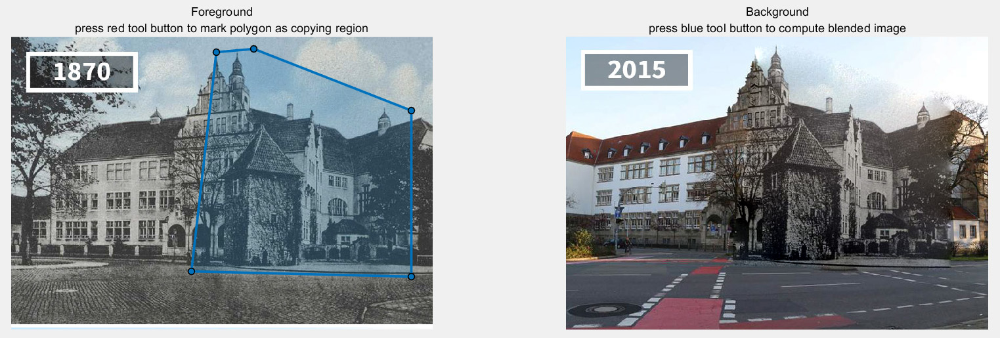
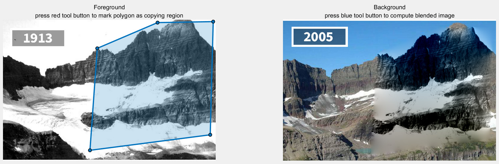
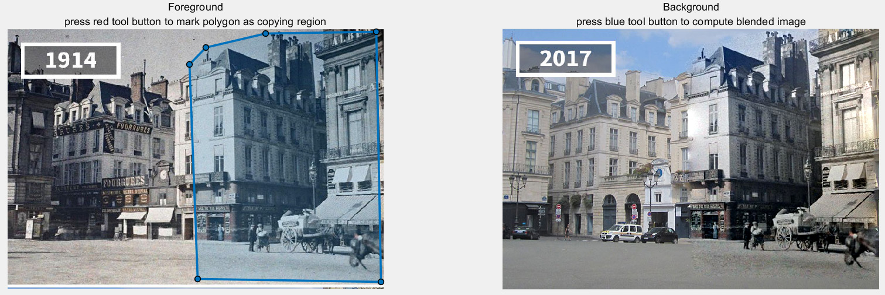
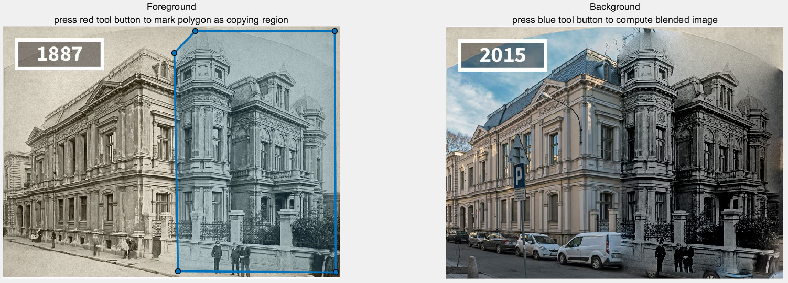
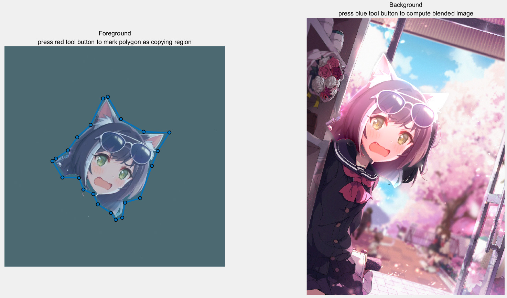
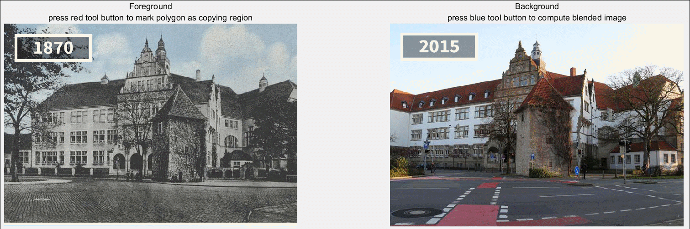

# 基于图像拼接技术实现 A look into the Past


成员及分工

+ 林哲晖 PB18010490
  + 算法调研 + coding
+ 张汉昌 PB18010480
  + coding + 实验报告撰写


### 问题描述


+ 给出黑白图像和彩色图像,将黑白图像的指定区域融合到彩色图像,从而达到过去与当下场景同时展现的效果.


+ 本质上是一个**图像融合**问题.图像融合问题有多种算法,经典且效果好的**泊松融合**将问题归结为解泊松方程,即**求偏微分方程数值解**.我们实现如下paper的算法:

​	[*Pérez, Patrick, et al. ‘Poisson Image Editing’. ACM SIGGRAPH 2003 Papers on - SIGGRAPH ’03, ACM Press, 2003, p. 313.*](https://www.cs.jhu.edu/~misha/Fall07/Papers/Perez03.pdf)


### 原理分析


​	可以将两幅拍摄内容相似的图像直接拼接,但结果将在边缘处出现不平滑的过渡.对于裁剪区域,我们的目标是:

+ 对于区域内部,尽可能接近旧图;
+ 对于区域边缘,同时保留旧图和新图的特征,使其平滑过渡.


​	图像的像素值可以看成一个**函数**.设裁剪区域的待求函数为$f$,底图(新)为$f^*$,目标图(旧)为$g$.上面的目标也就是:

+ 对于区域内部,尽量有$f=g$;
+ 对于区域边缘,用梯度刻画过渡程度:尽量有$\nabla f = \nabla f^*$且$\nabla f = \nabla g$.


​	上面第二条很难刻画:首先要动态确定区域边缘的范围,其次后面的两个等式很难都差不多满足,因为$\nabla f^*$和$\nabla g$一般相差比较多.文中给出的办法是:

+ 对于区域内部,尽量有$\nabla f = \nabla g$;
+ 对于区域边缘,严格保证$f = f^*$.

用一维函数来看,这个想法就比较直观了:区间端点处两点保持原样,中间的变化趋势接近$g$,得到的函数就既在区间内部保留$g$的特征,又在边界附近平滑过渡.而优化问题
$$
min|\nabla f - \nabla g|
$$
与
$$
\Delta f = \Delta g
$$
同解,也就是我们要求解的偏微分方程.实践证明这个方法的效果很好,其成功完全归因于上面的泊松方程,可见数学的强大.


### 代码实现


在Matlab上实现paper中的算法.将区域离散化后,其核心公式
$$
min_{f|_\Omega} \sum_{\left< p, q\right> \cap \Omega \neq \varnothing} (f_p - f_q - v_{pq})^2, with \; f_p = f_p^*, for \; all \; p \in \partial \Omega
$$
实际上是解线性最小二乘问题.按对应下标组装矩阵`A`后,我们只需要在MATLAB中调用

```matlab
dA = decomposition(A);
x = A \ b;
```

就可以用最小二乘法解得目标值`x`.想要漂亮的组装矩阵并设置边界条件有一定难度,但这是MATLAB 的内容,与算法无关.


为了取得更好的效果,可以使用混合梯度,我们也有实现.混合梯度即一个更好的梯度场,但由于计算速度更慢,所以不作采用。


### 效果展示

图片主要来源于 https://www.demilked.com/then-and-now-world-changes-rephotos/

能看出此算法的效果是很好的，基本实现了无缝贴合，但缺点是两张图片融合的位置不一定匹配，需要手动改变目标区域的位置得到较好的结果，此算法也许能使用SIFT等特征点匹配算法优化。

<table>
    <tr>
        <td ><center>Figure 1</center></td>
    </tr>
</table>

<table>
    <tr>
        <td ><center>Figure 2</center></td>
    </tr>
</table>

<table>
    <tr>
        <td ><center>Figure 3</center></td>
    </tr>
</table>

<table>
    <tr>
        <td ><center>Figure 4</center></td>
    </tr>
</table>


除此之外，此算法还能实现其他功能，比如“换头”

<table>
    <tr>
        <td ><center>Figure 5</center></td>
    </tr>
</table>

### 工程结构


|-- PoissonImageEditing

​		|-- blendImagePoisson.m

​		|-- poisson_editing.m

​		|-- toolMarkCB.m

​		|-- toolPasteCB.m


### 运行说明


MATLAB中执行`poisson_editing.m`即可.

在该代码文件的前两行

```matlab
im1 = imread('../data/set1/new.jpg');
im2 = imread('../data/set1/old.jpg');
```

分别把"set1"改为"set2","set3","set4","set99"，可用其他几组图片测试

运行后点击红色按钮绘制多边形区域，点击蓝色按钮计算结果，拖动多边形可以实时计算拖动后的结果。

<table>
    <tr>
        <td ><center>Drag Sample</center></td>
    </tr>
</table>